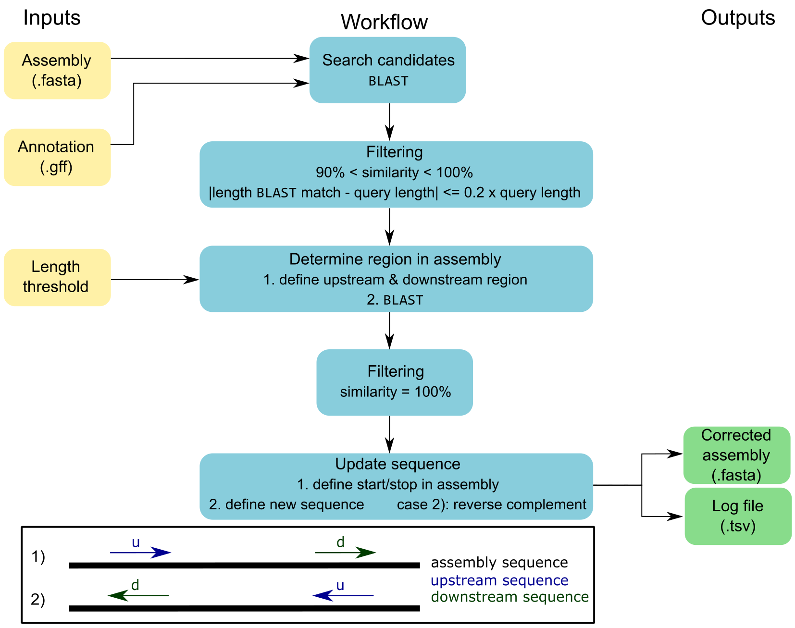
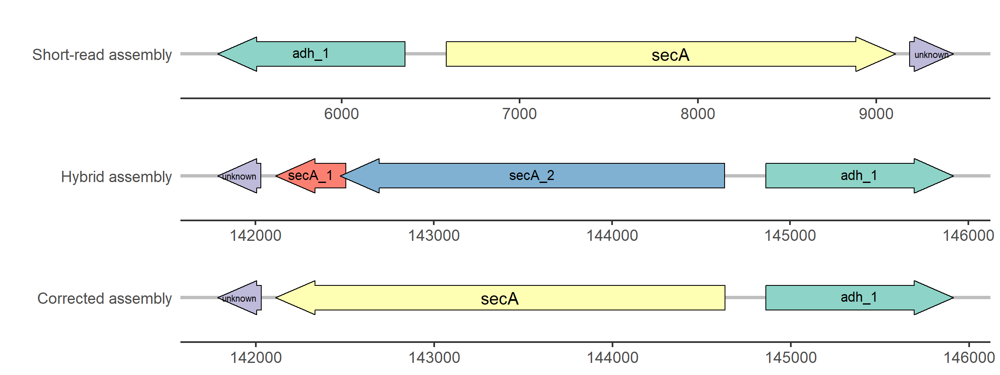
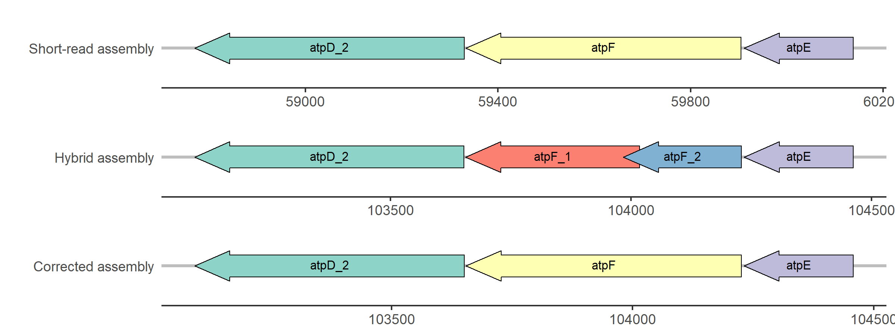

# ``cORFusi`` - Correction of ORFs utilizing short-read information

## Summary
``cORFusi`` (correction of ORFs utilizing short-read information) corrects hybrid *de novo* assembled genomes using additional short-read assemblies and corresponding annotations.
Updating gene sequences and thus correcting ORFs can lead to the annotation of complete genes.
Additional information regarding gene products and IDs could be added by [``Prokka``](https://github.com/tseemann/prokka) during annotation.

As input, an assembly (.fasta), an annotation (.gff), and a length threshold for up- and downstream region are required.
The genes listed in the annotation file are searched in the assembly via ``BLAST``.
These best-match candidates are filtered by two criteria: (1) 90% < similarity < 100%, (2) the length of the ``BLAST`` match may deviate by a maximum of 20% from the query length, i.e. length of the CDS.
Subsequently, upstream and downstream regions are defined for each candidate using the predefined length threshold, which are then blasted against the assembly.
Only exact matches are allowed.
This procedure determines the position of the ORF in the assembly.
If necessary, the reverse complement of the new sequence is calculated, which corresponds to the second case, where the downstream region aligns before the upstream region.
Finally, the sequence is updated and the corrected assembly and corresponding log file are saved.


***Figure 1: Simplified overview of the ORF correction workflow with ``cORFusi``.***

## Requirements
``cORFusi`` requires the following list of software to function properly. <br>

|Program/Package|Version|Note|
|---------------|-------|------|
|[``Python``](https://www.python.org/)|3.6.13||
|BCBio-gff|0.6.6||
|Biopython|1.76||
|[``BLAST``](https://blast.ncbi.nlm.nih.gov/Blast.cgi)|2.9.0|May work with other versions as well|

It is recommended to clone this repository:
```bash
git clone https://github.com/sandraTriebel/corfusi
cd corfusi
```

And then create a conda environment that contains all the dependencies:
```bash
conda env create -f conda_env/corfusi.yaml
OR
conda create -n corfusi python=3.6.13 blast=2.9.0 bcbio-gff=0.6.6 biopython=1.76

conda activate corfusi
```

## Usage
After cloning the repository and installing all dependencies, we can start the ORF correction:
```bash
python corfusi.py -f assembly -g annotation -t int
```

|Parameter|Description|
|---------|-----------|
|**-h, --help** |Show this help message and exit|
|**Mandatory**|
|**-f, --fasta**|Path to input assembly file (.fasta)|   
|**-g, --gff**|Path to input annotation file (.gff)|
|**-t, --threshold**|Length threshold (integer) determing up- & downstream region|
|**Optional**|
|**-p, --prefix**|Prefix for output files|
|**-o, --outdir**|Path to output folder|

## Output
``cORFusi`` stores the output files in the current working directory, if not stated otherwise (``-o/--outdir PATH``).
Two files are created:
1. corrected assembly in FASTA format (edit prefix with ``-p/--prefix name``)
2. log file in TSV format containing the annotation ID of the CDS, start and stop position of the updated sequence in the assembly, as well as the old and new sequence.

**Note:** ``cORFusi`` removes the created ``BLAST`` database and tabular output files after the correction.

## Visualization with ``R`` gene arrow maps
To simplify visualization of the improvements with ``cORFusi``, gene arrow maps were created using the ``R gggenes`` package.
The corresponding ``R`` script is stored in the ``scripts/`` folder.
You have to add paths to all three GFF files (short-read, hybrid and corrected assembly) and the log file (output from ``cORFusi``) as well as the path to the output folder.
Afterwards, you can execute the whole script.
Currently, gene arrow maps are generated only if the corrected gene has a name in the short-read assembly (because starting point for extracting all needed information is the short-read CDS ID in the log file ).

**Note:** Extracting the information based on the gene name is simple and was sufficient for these examples, but can lead to problems.
``Prokka`` may use the same name for different genes in different runs.
Please keep in mind to check the ``Prokka`` GFF files if the generated gene arrow map shows a different genomic context.
This does not mean that ``cORFusi`` is working incorrectly, but demonstrates the difficulties of uniformly annotating genes and thus extracting the information for a gene in different assemblies.


***Figure 2: Simplified visualization of the update of the secA gene in strain 11DD0261.*** <br>
The secA gene of the short-read assembly was aligned with high similarity (90% < similarity < 100%)
to the hybrid assembly, but contains mismatches or gaps. In contrast, the hybrid assembly carries two
genes named secA_1 and secA_2 in the region where ``BLAST`` aligned the short-read CDS. Consequently,
as mentioned above, the sequence was updated and the annotation of the corrected assembly revealed
a complete secA gene. In addition, this example demonstrates the ability of ``cORFusi``
to include the reverse complement of the sequence when necessary.


***Figure 4: Simplified visualization of the update of the atpF gene in strain 15DD0234.*** <br>
The atpF gene of the short-read assembly was aligned with high similarity (90% < similarity < 100%)
to the hybrid assembly, but contains mismatches or gaps. In contrast, the hybrid assembly carries two
genes named atpF_1 and atpF_2 in the region where ``BLAST`` aligned the short-read CDS. Consequently,
as mentioned above, the sequence was updated and the annotation of the corrected assembly revealed
a complete atpF gene.